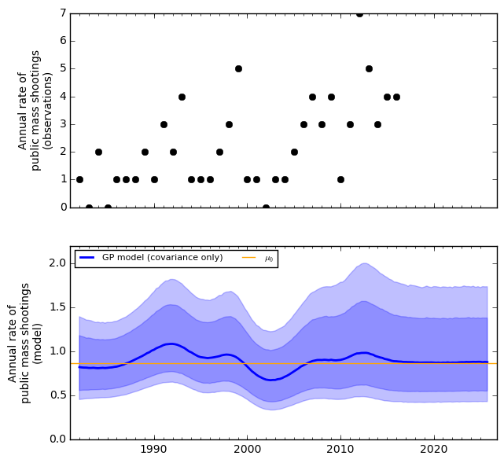
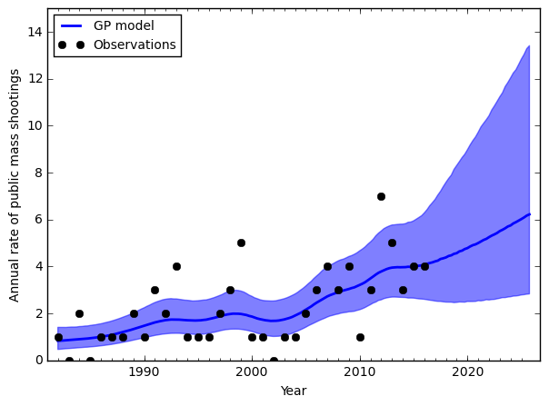
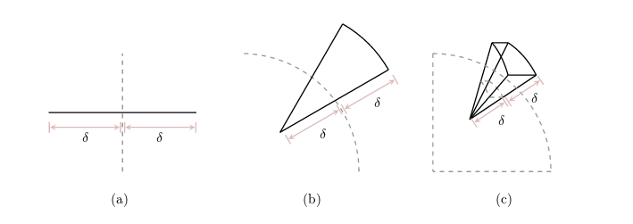
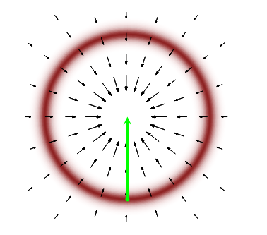

```{r setup, include=FALSE}
knitr::opts_chunk$set(echo = TRUE)
```

## StanCon 2017

- First annual conference for the Stan Probabilistic Programming Language
- Talks highlighted new developments, case-studies, and future directions
- Got to meet prominent applied bayesian statisticians

## What is bayesian statistics

- A field of statistics devoted to assigning probabilities to parameters, and
  updating in response to new data
- Contrast with null hypothesis testing which assigns probabilities to data
- A logical consequence of two important concepts:
    1. The subjective interpretation of probability
    2. Bayes' Theorem

## The subjective interpretation of probability

- In frequentist interpretation, probabilities represent the long term chances of an event occuring
- In the subjective interpration, probabilities represent degrees of belief about the chance of
  an event

## Bayes Theorem

$$ P(\theta | D) = \frac{\tikzmarkin{a}P(D | \theta)\tikzmarkend{a} *  P(\theta)}{P(D)} $$

1. $P(D | \theta)$: The likelihood of the data given the parameters

## Bayes Theorem

$$ P(\theta | D) = \frac{P(D | \theta) *  \tikzmarkin{b}P(\theta)\tikzmarkend{b}}{P(D)} $$

1. $P(D | \theta)$: The likelihood of the data given given the parameters
2. $P(\theta)$: The prior probability of the parameters

## Bayes Theorem

$$ P(\theta | D) = \frac{P(D | \theta) *  P(\theta)}{\tikzmarkin{c}P(D)\tikzmarkend{c}} $$

1. $P(D | \theta)$: The likelihood of the data given given the parameters
2. $P(\theta)$: The prior probability of the parameters
3. $P(D)$: The probability of the data (normalizing constant)

## Bayes Theorem

$$ \tikzmarkin{d}P(\theta | D)\tikzmarkend{d} = \frac{P(D | \theta) *  P(\theta)}{P(D)} $$

1. $P(D | \theta)$: The likelihood of the data given given the parameters
2. $P(\theta)$: The prior probability of the parameters
3. $P(D)$: The probability of the data (normalizing constant)
4. $P(\theta | D)$: Posterior probability of the parameters

## The Posterior

- The posterior is the goal of bayesian inference
- The posterior summarize our beliefs about the state of the system
- How do we get it?

## Conjugate Bayesian Analysis

- If we carefully choose our models carefully the posterior can be computed directly from
  the prior and the data.

## ~~Conjugate Bayesian Analysis~~

- If we carefully choose our models carefully the posterior can be computed directly from
  the prior and the data.
- Only works for a small class of models
- We need something more general

## General Solution

- Approximate
- Sample from the unnormalized posterior, estimate the normalizing constant
- Sampling is unbiased in ideal case, but can be troublesome in practice

## What is bayesian statistics

> bayesian statistics is the largest field devoted to ignoring a denominator  
> -unknown 

## History

- Metropolis-Hastings: During the Manhattan project early computers were used
to sample from arbitrary distributions. The original algorithm is still in use
today
- Gibbs-Sampling: A successor to Metropolis-Hastings became democratized in the form
of **B**ayesian Inference **U**sing **G**ibs **S**ampling (BUGS), a software
package that allowed users with personal computers to sample posteriors.
- Hamilitonian-Monte-Carlo: A tool from physics imported by U of T's own
Radford Neal sped up sampling enough to be practical. Made available by
the Stan programming language.

## Stan


## Stan

Stan Provides:

1. Model fitting
2. Posterior Sampling
3. Automatic differentiation
4. Variational Inference
5. Wrappers for R and Python

## Conference Highlights

1. **Andrew Gelman's introduction and post-mortem of a flawed election model**

## Key Points

- Good data is better than good methods
- Highlighted problem of using summarized and convenience data
- Discussed the need for higher level languages for writing models
- Emphasized three main objects of statistics
    1. Generalize from sample to population
    2. Generalize from controls to treatment
    3. Generalize from measurement to construct
- Stressed unbiased estimation is less important than typically taught
  in stats education. Publication biases and forking paths in modelling
  mean all estimates are biased.
  
## Conference Highlights

1. Andrew Gelman's introduction and post-mortem of a flawed election model
2. **Charles Margosian's introduction to ODEs with Stan**

## Key Points

- Ordinary differential equation models are useful when you can only
  measure rates of change of your quantities of interest
- Frequently used in pharmacometric models, measuring movement of
  compounds between body compounds
- Stan now includes support for linear and non-linear bayesian estimation
  of ODEs
  
## Conference Highlights

1. Andrew Gelman's introduction and post-mortem of a flawed election model
2. Charles Margosian's introduction to ODEs with Stan
3. **Rob Trangucci and Nathan Sanders used gaussian process regression
   for modelling time series data**
   
## Key Points

- Gaussian processes describe a distribution of functions, coverned by
  a mean and covariance function.
- Rob Trangucci introduced the new gaussian process functions in Stan
- Nathan Sanders demonstrated using them to fit mass-shooting data
  to assess the chance that the tend of mass shootings is increasing
- Modelled as a poisson regression, allowing the residuals to be modelled
  by a gaussian process
- Allowing the length scale of the gaussian process to vary meant
  the model could range from uncorrelated residuals (standard poisson)
  to fully modelled by the covariance
  
## Raw Data and Covariance Only
  


## Short Length Scale



## Long Length Scale


  
## Conference Highlights 

1. Andrew Gelman's introduction and post-mortem of a flawed election model
2. Charles Margosian's introduction to ODEs with Stan
3. Rob Trangucci and Nathan Sanders used gaussian process regression
   for modelling time series data
4. **Michael Betancourt's introduction to Hamiltonian Monte Carlo**

## Introduction to Hamiltonian Monte Carlo

- Statistics comes down to estimating expectations from
  probability distributions
  
$$ \mathbb{E}|f(x)| = \int f(x)P(x)dx $$

- To compute expectations quickly you need to focus on regions of
  parameter space where $f(x)P(x)$ is high

## Estimating Expectations

$$ \mathbb{E}|f(x)| = \int f(x)P(x)dx $$

- In most cases the exact form of $f(x)$ is difficult to capitalize on
- So you decide to focus on where $P(x)$ is high... Right?

## High Dimensional Geometry

- Unfortunately no!
- In higher dimensions the volume occupied by the mode is small
- Shrinks exponentially as number of dimensions increases

## High Dimensional Geometry



## High Dimensional Geometry

$$ \mathbb{E}|f(x)| = \int f(x)P(x)dx $$

- In higher dimensions the volume occupied by the mode is small
- Shrinks exponentially as number of dimensions increases
- Integration volume $dx$ comes to dominate the integral

## Typical Set

$$ \mathbb{E}|f(x)| = \int f(x)~\tikzmarkin{e}P(x)dx\tikzmarkend{e} $$

- As the dimensions increase, the region where $dx$ is large
  and $P(x)$ isn't negligible contracts to thin shell.
- This shell is called the typical set
- Markov Chain Monte Carlo aims to explore this set

## Typical Set


## Metropolis-Hastings

- Metropolis-Hastings aims to explore the typical set by
  proposing new positions $x$ adding gaussian noise to
  the current position
- If the proposed new location is has a higher $P(x)$ 
  the markov chain moves toward it, if it's low it moves
  toward it with probability proportional to $P(x)$.
- Since the typical set is narrow, proposed locations are
  almost always going to fall into zones with very low $P(x)$
- Solution is to reduce step size, but this means the typical
  set gets explored very slowly.
  
## Metropolis-Hastings


  
## Hamiltonian Monte Carlo

- Use information about the shape of the distribution to
  better explore the typical set
- Imagine the the markov chain as a particle orbiting
  areas of high probability mass
- The gradient of the probability function points toward
  the mode (gravity)

## Hamiltonian Monte Carlo



## Hamiltonian Monte Carlo

- Given a certain amount of energy the markov chain can orbit
  stably
- The amount of energy determines where in the probability mass the 
  chain orbits
- Drawing energies from the correct distribution allows you to explore
  the typical set.
- Big improvements to come with better choices of energy distribution

## Take-Aways

- Bayesian statistics is getting more practical every day
- Hybrid parametric non-parametric techniques could be highly
  beneficial for modelling a variety of phenomena
- Many tools to take the pain out of model fitting exist (rstanarm, rethinking), 
  so don't be afraid to try them out.
- Never underestimate a good intuitive explanation

## More Information

**Talks**: http://mc-stan.org/events/stancon  

**Notebooks with code**: https://github.com/stan-dev/stancon_talks  

**Betancourt's Conceptual Introduction to HMC**: https://arxiv.org/pdf/1701.02434.pdf

---

Questions?


  

  
